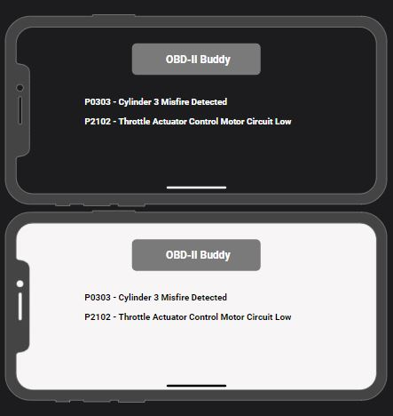

# Student Details:
Name: Robert Squires  
Degree/Major: Bachelor of Science in Computer Science  
Project Advisor: Dr. Hayes  
Expected Graduation Date: December 2023

Document #002

# Requirements Documentation:
1. Requirement 1:
    - Type: Functional
    - Description: Bluetooth ELM 327 OBD-II connector
    - Rationale: Allows the application to communicate with the vehicle over the OBD-II CAN Bus.
    - Fit Criterion: I will purchase from Amazon and ensure proper fitment to OBD-II receptical in my personal vehicle.  I will then connect the adapter to my iPhone through Bluetooth and using a 3rd party OBD-II application to ensure that the connector is functioning properly.
    - Priority: 1
    - Dependencies: n/a

2. Requirement 2:
    - Type: Usability
    - Description: Main menu of application
    - Rationale: The main menu will be the hub for the entire application. The user will make all initial selections from this menu.
    - Fit Criterion: The main menu will have an option to perform initial setup for a first time user. Then go to the regular main menu that allows the user to press a button to: view live data, scan for DTCs, view vehicle information, or exit the application.
    - Priority: 2
    - Dependencies: 1

    ![Main-Menu-GUI-Landscape-dark/light-picture] (../media/images/Original Mockups/OBD-II Buddy Main GUI.JPG)

3. Requirement 3:
    - Type: Functional
    - Description: The View Guages button will open the View Guages GUI to monitor user defined datatypes for the user's vehicle.
    - Rationale: The View Guages button will bring the user defined datatypes into the View Guages GUI and allow the user to monitor valuable vehicle information in real time. The baseline setup will have four datatypes monitoring locations.
    - Fit Criterion: Once the View Guages button is pressed, it should immediately bring the View Guages GUI to screen and display the four selected datatypes at the corners of the screen.
    - Priority: 3
    - Dependencies: 1-2

    ![View-Guages-GUI-Landscape-dark/light-picture] (../media/images/Original Mockups/OBD-II Buddy View Guages GUI.JPG)

4. Requirement 4:
    - Type: Functional
    - Description: The Code Scanner button will bring any PIDs in the ECU into the application's GUI.
    - Rationale: The Code Scanner button will bring any PIDs in the ECU into the GUI. This will allow the user to see the actual codes their vehicle is producing and allow them to begin troubleshooting the repair.
    - Fit Criterion: Once the Code Scanner button is pressed, it should bring any PIDs in the ECU into a list on the Code Scanner GUI. The PIDs will have the actual code, such as: P0303 in hexidecimal that it receives from the ECU.
    - Priority: 3
    - Dependencies: 1-2

    

5. Requirement 5:
    - Type: Functional
    - Description: The Exit Program button will close the application on the current device.
    - Rationale: The Exit Program button will allow a one touch interaction to close the application.
    - Fit Criterion: Once the End Program button is pressed, it should close the application and end the applications communication with the OBD-II port.
    - Priority: 3
    - Dependencies: 1-2

6. Requirement 6:
    - Type: Usability
    - Description: OBD-II Buddy button returns the user to Main Menu GUI.
    - Rationale: The OBD-II Buddy button will allow the user a one touch interaction to return from their current GUI to the Main Menu GUI.
    - Fit Criterion: Once the OBD-II Buddy button is pressed, it should return the user to the Main Menu GUI.
    - Priority: 4
    - Dependencies: 3 or 4

7. Requirement 7:
    - Type: Functional
    - Description: Guage Monitor #1
    - Rationale: The Guage Monitor #1 will allow the user to see their selected datatype information in the top-left corner of the screen.
    - Fit Criterion: The Guage Monitor #1 display should display up-to-date information for the selected data type in the top-left corner of the View Guages GUI. The information will be relevantly updated to always keep the user aware of the specified datatype's current state.
    - Priority: 5
    - Dependencies: 3

8. Requirement 8:
    - Type: Functional
    - Description: Guage Monitor #2
    - Rationale: The Guage Monitor #2 will allow the user to see their selected datatype information in the top-right corner of the screen.
    - Fit Criterion: The Guage Monitor #2 display should display up-to-date information for the selected data type in the top-right corner of the View Guages GUI. The information will be relevantly updated to always keep the user aware of the specified datatype's current state.
    - Priority: 5
    - Dependencies: 3

9. Requirement 9:
    - Type: Functional
    - Description: Guage Monitor #3
    - Rationale: The Guage Monitor #3 will allow the user to see their selected datatype information in the bottom-left corner of the screen.
    - Fit Criterion: The Guage Monitor #3 display should display up-to-date information for the selected data type in the bottom-left corner of the View Guages GUI. The information will be relevantly updated to always keep the user aware of the specified datatype's current state.
    - Priority: 5
    - Dependencies: 3

10. Requirement 10:
    - Type: Functional
    - Description: Guage Monitor #4
    - Rationale: The Guage Monitor #4 will allow the user to see their selected datatype information in the bottom-right corner of the screen.
    - Fit Criterion: The Guage Monitor #4 display should display up-to-date information for the selected data type in the bottom-right corner of the View Guages GUI. The information will be relevantly updated to always keep the user aware of the specified datatype's current state.
    - Priority: 5
    - Dependencies: 3

11. Requirement 11:
    - Type: Usability
    - Description: Guage Monitor Datatype Selectability and Position
    - Rationale: The Guage Monitor Datatype Selectability and Position functionality will allow the user to select their desired datatype to monitor, and which of the four positions on the View Guages GUI to set it.
    - Fit Criterion: By touching on the View Guages GUI corner where Guage Monitor 1, 2, 3 or 4 is located, the user should be able to select their desired datatype to monitor and the application will show it in that location as Guage Monitor 1-4 as selected.
    - Priority: 6
    - Dependencies: 3

12. Requirement 12:
    - Type: Usability
    - Description: Save User Preferences
    - Rationale: The Save User Preferences functionality will save the user's dataypes and positions in the View Guages GUI.
    - Fit Criterion: After the user's initial use of the application, it will save a copy of the datatypes to monitor and their display locations as the user's preferences. These preferences can be changed by the user at any point and will be saved upon closing the application.
    - Priority: 7
    - Dependencies: 5 and 11

13. Requirement 13:
    - Type: Usability
    - Description: Save Preferences Check
    - Rationale: The Save Preferences Check box will ensure the user is aware that their current datatype preferences will be save upon exiting the application.
    - Fit Criterion: Once the End Program button is pressed, the application will display a dialog letting the user know that their preferences will be saved up exiting the program. 
    - Priority: 8
    - Dependencies: 5

    ![App-Preference-Check-GUI-Landscape-dark/light-picture] (../media/images/Original Mockups/OBD-II Buddy Application Preference.JPG)
    
1.  Requirement 14:
    - Type: Usability
    - Description: Save Preferences Check (Yes Button)
    - Rationale: The Yes button will allow the user to save their preferences and close out the application.
    - Fit Criterion: Once the Yes button is pressed, it should save the user's preferences and close out the application.
    - Priority: 9
    - Dependencies: 13

2.  Requirement 15:
    - Type: Usability
    - Description: Save Preferences Check (No Button)
    - Rationale: The No button will allow the user to return to the Main Menu GUI instead of saving preferences and exiting the application.
    - Fit Criterion: Once the No button is pressed, it will return the user to the Main Menu GUI.
    - Priority: 9
    - Dependencies: 13
